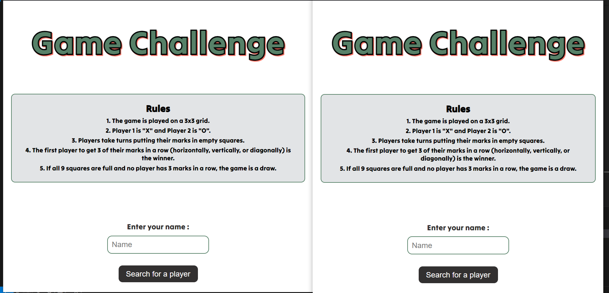

# Two-Player Tic-Tac-Toe Game

- Developed a simple two-player Tic-Tac-Toe game with a focus on real-time interaction using gameId and a user-friendly interface.

## Overview

The Tic-Tac-Toe game consists of the following features:
- Real-time game play between two players using gameId.
- Players can join a game and are assigned either "X" or "O".
- Turns are managed so that players take alternate moves.
- The game checks for a win or draw condition after each move.
- The game board is reset once the game is over.

## Components

- **index.js**: The main server file that sets up the Express server and Socket.io for real-time communication.
- **index.html**: The main HTML file for the game interface.
- **style.css**: The CSS file for styling the game interface (included in HTML file as internal CSS).
- **loading.gif**: The loading image displayed while waiting for an opponent.

## Prerequisites

- Node.js (version 14 or higher)
- npm (version 6 or higher) or yarn

## Installation

1. **Clone the repository:**
    ```bash
    git clone https://github.com/Pradeep880/Game
    ```

2. **Install dependencies:**
    ```bash
    npm install
    ```

## Usage

1. **Start the server:**
    ```bash
    node index.js
    ```

2. **Open your browser and navigate to:**
    ```
    http://localhost:3000
    ```

3. **Running the Application in Two Terminals:**

    - **Terminal 1:** Start the server
        ```bash
        node index.js
        ```

    - **Terminal 2:** Open the application
        ```bash
        # Open a new terminal
        open http://localhost:3000
        ```

4. **Testing the Game:**

    - Open the game in two different browser tabs or windows.
    - Each tab/window will act as a separate player.
    - Enter player names and start playing.

## Game Rules

- The game is played on a 3x3 grid.
- Player 1 is "X" and Player 2 is "O".
- Players take turns putting their marks in empty squares.
- The first player to get 3 of their marks in a row (horizontally, vertically, or diagonally) is the winner.
- If all 9 squares are full and no player has 3 marks in a row, the game is a draw.

## Project Structure

- **index.js**: The main server file that sets up the Express server and Socket.io for real-time communication.
- **index.html**: The main HTML file for the game interface.
## Screenshots
### Home Page


### Player Page

## Game Flow

1. **Start the Game:**
    - When a player opens the game in the browser, they will be prompted to enter their name.
    - The player clicks the "Search for a player" button to find an opponent.
    - The server waits for two players to join the game.

2. **Game Initialization:**
    - Once two players join, they are assigned as Player 1 ("X") and Player 2 ("O").
    - The game board is displayed, and Player 1 starts the game.

3. **Playing the Game:**
    - Players take turns to place their marks on the grid.
    - The server listens for each player's move and updates the game state.
    - The current player's turn is displayed at the top.

4. **Game Over:**
    - The game checks for a win or draw after each move.
    - If a player wins, the game displays the winner.
    - If the game is a draw, it is announced.
    - The server resets the game state for the next round.


